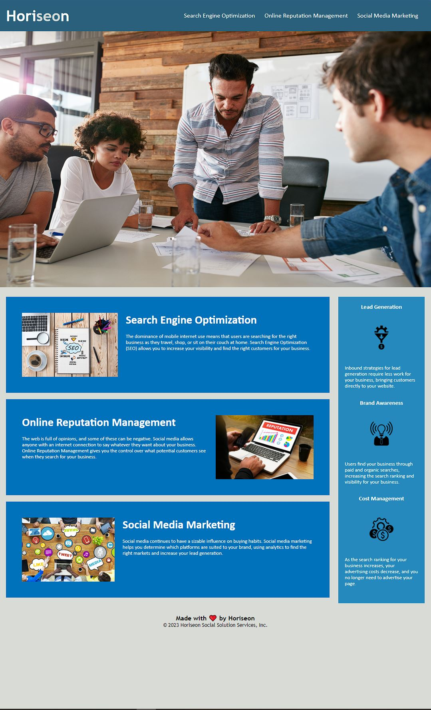

# Refactor-and-Accessibility-Assignment-Evan-K

## Description
Webpage for Horiseon Marketing that presents basic information on the services they provide and the benefits of using those services.

Webpage can be found at https://33649ek.github.io/Refactor-and-Accessibility-Assignment-Evan-K/

## Installation
N/A

## Usage
Interactable elemtents, such as the navigation bar, on this webpage can be selected my mouse, or if not possible, by using TAB and SHIFT+TAB.

## Credits
Starter code taken from https://git.bootcampcontent.com/University-of-Denver/DU-VIRT-FSF-PT-10-2023-U-LOLC/-/tree/main/01-HTML-Git-CSS/02-Challenge.

## License
MIT License